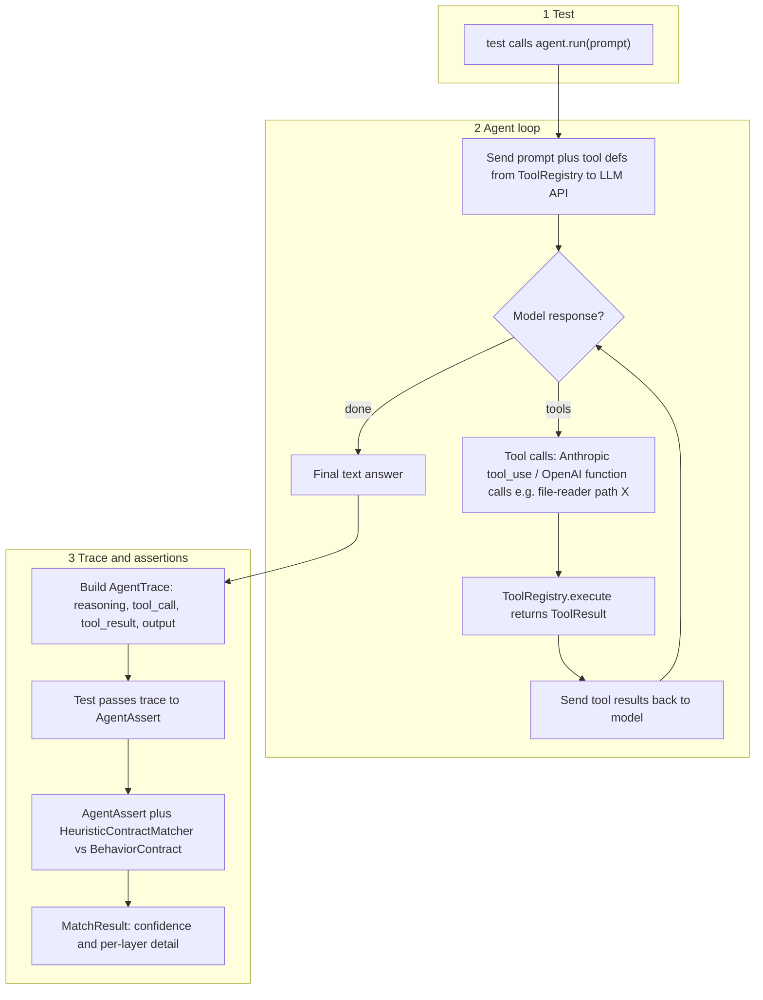

# AgentAssert

**What this is:** Automated tests for an **AI agent** that can **call tools** (for example: “read this file,” “call this API”). The tests check **what the agent decided to do** (which tools it picked, in what order, and what it said at the end)—not just the final text.

**For QA:** Think of it like testing **business rules on decisions**, not only checking a screen or a single return value. Failures attach **traces** (a step-by-step log) so you can see prompts, tool calls, and outputs in the Playwright HTML report.

This repo is a **sample / reference project** (`"private": true` in `package.json`—not published as a product). You can copy patterns from it into your own codebase.

---

## Repository layout


| Folder / file | In plain terms |
|---------------|----------------|
| **`framework/`** | **Checks you reuse:** “Was tool X used?” “Does the answer follow our rules?” Helpers include `AgentAssert`, `HeuristicContractMatcher`, and shared types for traces and contracts. |
| **`index.ts`** | Single entry point for importing the framework from this repo when you copy it in. |
| **`examples/agent/`** | **Demo agent** (the app under test): chat loop, tool list, sample tools (`file-reader`, `api-caller`). Swap this for your real agent; keep the same trace shape if you keep these tests. |
| **`tests/`** | Playwright test files plus **`tests/fixtures/setup.ts`**, which builds the demo agent for each scenario. |


---

## About

**What gets tested:** Five patterns that cover **tool choice**, **output rules**, **order of steps**, **staying inside allowed tools**, and **behavior when something fails**.

**Tool list:** Tools are registered in a **`ToolRegistry`** (a named list the model sees and that your code runs when the model asks). There is **no separate MCP server** in the default demo—tools run **inside the test process** so runs are **fast and stable**.

**“Behavior contracts”:** Rules like “must include these fields,” “should mention these words,” “must not match these patterns.” The matcher is **rule-based** (keywords and patterns)—**not** a second AI judging the first, and **not** “true” semantic understanding. The **`confidence`** score is a **rough pass/fail helper** for tuning, not a scientific accuracy percentage. More detail: **Heuristic matching: scope and limits** below.

**Why Playwright:** Same tool as browser E2E tests, but here it drives **API + agent** flows. You get **retries**, **timeouts per test**, and **HTML reports** with attachments (good for flaky LLM output).

---

## Architecture: How the Pieces Connect

```
┌───────────────────────────────────────────────────────────────────────────────────┐
│                    YOUR TEST FILE                                                 │
│  import { AgentAssert } from 'agent-assert'  // or ../../framework/AgentAssert.js │
│  const trace = await agent.run("some prompt")                                     │
│  AgentAssert.toolWasInvoked(trace, 'file-reader')                                 │
│  AgentAssert.satisfiesContract(trace.output, CONTRACT)                            │
└─────────────────┬──────────────────────────┬──────────────────────────────────────┘
                  │                          │
      ┌───────────▼─────────┐    ┌───────────▼─────────────┐ 
      │    Agent (app under │    │   AgentAssert           │
      │     test)           │    │   (checks / asserts)    │
      │ 1. Send prompt to   │    │                         │
      │    LLM (Anthropic / │    │ - toolWasInvoked()      │
      │     OpenAI / Ollama)│    │ - satisfiesContract()   │
      │ 2. Get tool calls   │    │ - boundaryNotViolated() │
      │    from model       │    │                         │
      │ 3. Execute tool     │    │ - traceFollowsSequence()│
      │ 4. Send result back │    │                         │
      │ 5. Build TRACE      │    └───────────┬─────────────┘
      └────────┬────────────┘                │
               │                  ┌────────────▼──────────────┐
    ┌──────────▼───────────┐      │ HeuristicContractMatcher  │
    │   ToolRegistry       │      │                           │
    │                      │      │ 1. Structure (fields)     │
    │ file-reader → run()  │      │ 2. Keywords (word checks) │
    │ api-caller  → run()  │      │ 3. Forbidden (patterns)   │
    └──────────────────────┘      │ 4. Optional custom rule   │
                                  │                           │
                                  │ → MatchResult + score     │
                                  └───────────────────────────┘
```

### Data Flow (Step by Step)




1. The test starts the agent with a **plain-language task** (`agent.run(prompt)`).
2. The agent sends that task to the **LLM** (Anthropic, OpenAI, or local Ollama) and includes the **list of tools** from the ToolRegistry.
3. The model may answer with **“please run tool X with these inputs”** (the exact format differs by vendor; see diagram above).
4. The agent runs the real tool code through the ToolRegistry and gets a **ToolResult** (success/failure + data).
5. That result goes **back to the model**; steps 3–5 may **repeat** until the model stops asking for tools.
6. The model eventually returns a **final text** answer (or stops).
7. The agent assembles an **`AgentTrace`**: a **full log** of reasoning, each tool call, each tool result, and final output.
8. The test sends that trace into **AgentAssert** helpers (pass/fail checks).
9. For text rules, **HeuristicContractMatcher** compares the output to a **BehaviorContract** (keywords, patterns, etc.).
10. You get a **`MatchResult`**: pass/fail style outcome, a **confidence** score, and **details** per check layer (useful when debugging failures).

---

## The Five Testing Patterns

### Pattern 1: Tool Invocation Assertion

**File:** `tests/behavioral/intent-routing.spec.ts`

**What it tests:** For a user request like “read this log file,” did the agent actually call the **right tool** (e.g. file-reader) and not something else?

**Why it matters:** A bad answer can still *sound* fine. This checks the **decision** (which tool ran), not only the final text.

**Key assertion:**

```typescript
const result = AgentAssert.toolWasInvoked(trace, 'file-reader', { filePath: /.*\.log$/ });
AgentAssert.expectMatched(result, 'file-reader should be invoked'); // embeds AgentAssert.formatResult(result) on failure
```

**What to look at in the code:**

- `AgentAssert.toolWasInvoked()` — finds **tool_call** steps in the trace
- `paramMatchers` — optional checks on **arguments** passed to the tool (e.g. file path)
- `AgentAssert.expectNotMatched()` — asserts a tool was **not** used (when the test expects a negative case)

---

### Pattern 2: Behavior Contract Validation

**File:** `tests/behavioral/output-contract.spec.ts`

**What it tests:** Does the final answer follow **agreed rules** (required fields, must-include words, forbidden phrases)—without requiring an **exact** copy-paste string match?

**Why it matters:** LLM wording changes every run. Contracts check **flexible rules** instead of one frozen sentence. If wording drifts, add keywords, relax thresholds, or add a **customValidator** (see **Heuristic matching: scope and limits**).

**Key assertion:**

```typescript
const result = AgentAssert.satisfiesContract(trace.output, BehaviorContract.SUMMARIZATION, 0.5);
AgentAssert.expectMatched(result, 'SUMMARIZATION contract should pass');
```

**What to look at in the code:**

- `BehaviorContract.ts` — ready-made rule sets (fields, keywords, forbidden patterns)
- `HeuristicContractMatcher.evaluate()` — runs structure + keywords + forbidden patterns (+ optional custom rule)
- `minKeywordMatchRatio` — how many of the listed keywords must appear
- `forbiddenPatterns` — if the output matches these, the contract **fails**

---

### Pattern 3: Multi-Step Trace Verification

**File:** `tests/behavioral/tool-invocation.spec.ts`

**What it tests:** For workflows that need **more than one tool** (e.g. read file, then call API), did the agent follow a **sensible order** of steps?

**Why it matters:** UI tests usually see **screens**. Here you inspect the **sequence of tool calls** inside the trace—something classic UI checks do not cover.

**Key assertion:**

```typescript
const result = AgentAssert.traceFollowsSequence(trace, [
  { type: 'tool_call', toolName: 'file-reader' },
  { type: 'tool_call', toolName: 'api-caller' },
]);
AgentAssert.expectMatched(result, 'trace should show file-reader then api-caller');
```

**What to look at in the code:**

- `AgentAssert.traceFollowsSequence()` — checks that steps appear in the **right order** (they do not have to be back-to-back)
- The trace can include **reasoning** lines between tool calls
- `toolCallCountInRange()` — optional check that the agent did not call tools **too many** or **too few** times

---

### Pattern 4: Boundary/Scope Enforcement

**File:** `tests/boundary/hallucination-guard.spec.ts`

**What it tests:** Did the agent **only use tools it is allowed to use** and avoid **out-of-scope** actions?

**Why it matters:** Models sometimes invent tool names or try extra actions. This pattern catches **scope creep** and **fake tool calls**.

**Key assertion:**

```typescript
const result = AgentAssert.boundaryNotViolated(trace, ['file-reader']);
AgentAssert.expectMatched(result, 'only file-reader should be used');
```

**What to look at in the code:**

- `boundaryNotViolated()` — fails if any **tool outside the allow-list** was called
- `createFileOnlyAgent()` — builds an agent with **only** certain tools registered (tight boundary)
- `HALLUCINATION_PROMPTS` — tricky prompts meant to provoke **wrong** or **extra** tool use
- `SCOPE_BOUNDED` contract — rules that flag **forbidden** wording when the task should stay narrow

---

### Pattern 5: Failure & Retry Observability

**File:** `tests/boundary/retry-behavior.spec.ts`

**What it tests:** When a tool **errors** (file missing, API down), does the agent **admit the failure** and avoid claiming success? Does it **retry** within reasonable limits?

**Why it matters:** Many demos only test the happy path. Here failures are **forced** so you can see honest vs misleading behavior.

**Key assertions (examples):**

```typescript
// Honest reporting: output mentions failure / contract passes
expect(mentionsFailure, 'output should reflect tool failure').toBe(true);

// No false success after API error
expect(claimsSuccess, 'must not claim ticket created when API failed').toBe(false);

// Retry cap: count only `file-reader` tool_call steps (metadata.toolCallCount includes all tools)
const n = trace.steps.filter(s => s.type === 'tool_call' && s.toolName === 'file-reader').length;
AgentAssert.expectMatched(
  {
    matched: n >= 1 && n <= 3,
    confidence: n >= 1 && n <= 3 ? 1 : 0,
    details: [`file-reader invocations: ${n} (expected: 1–3)`, '…'],
  },
  'file-reader retries on failure should stay between 1 and 3'
);
```

**What to look at in the code:**

- `createFailingFileReaderAgent()` — file-reader always **fails** on purpose (error-path testing)
- `GRACEFUL_FAILURE` contract — expects **honest** error language; forbids **false success** claims
- `retryCount` in trace metadata — counts tool results with **`success: false`**
- Cascade tests — what happens **after** the first tool fails (downstream steps)

---

## Key Files Explained

### framework/types.ts

**Shared shapes** for traces, contracts, and tools. Tests and the demo agent both use these types so “what we record” and “what we assert” stay in sync.

- **`AgentTrace`** — the main object assertions read
- Other types: steps, output, contracts, tool definitions, match results

### examples/agent/agent.ts

**Demo agent** (the application under test). It is **not** the reusable assertion library. Flow in plain terms:

1. Send the user message and tool list to the LLM (**Anthropic** or **OpenAI-style** API, including Ollama).
2. Read the model reply: plain text and/or **requests to call tools**.
3. Run the requested tools; send results back to the model.
4. Repeat until the conversation finishes.
5. Package everything into an **`AgentTrace`**.

**How to pick a provider:** Set `LLM_PROVIDER` (or `provider` in code) to `anthropic`, `openai`, or `ollama`. Use **`ANTHROPIC_API_KEY`** / **`OPENAI_API_KEY`** as needed. For Ollama, the client uses **`OPENAI_BASE_URL`**, then **`OLLAMA_BASE_URL`**, then **`http://127.0.0.1:11434/v1`**. For **`LLM_PROVIDER=openai`**, only **`OPENAI_BASE_URL`** sets a custom base (Azure, proxy, etc.); **`OLLAMA_BASE_URL`** is not used so you do not accidentally send OpenAI traffic to Ollama.

**If you edit the system prompt here**, update test expectations and contracts so they still match what you want the agent to do.

### examples/agent/tools/file-reader.ts and api-caller.ts

**Sample tools:** JSON schema + **run** function. In the demo they run **locally** (real disk read; API tool uses **mock** responses). To use a real MCP server later, you would replace the **run** logic—not necessarily the schema.

**Security:** `file-reader.ts` blocks path tricks; read the file comments before changing paths.

### examples/agent/tools/registry.ts

**Name → tool implementation.** Also turns the same definitions into the **Anthropic** or **OpenAI** tool format the API expects.

### framework/HeuristicContractMatcher.ts

**Rule-based scoring (not “AI understands meaning”).** Rough weights:

1. **Structure** (~40%) — required fields (and optional length checks)
2. **Keywords** (~35%, adjusted if you add a custom rule) — listed words must appear as **substrings** (after lowercasing)
3. **Forbidden** (~25%) — if a **regex** matches, the contract fails that path
4. **Custom** (optional) — your own function for extra checks

The **`confidence`** number is a **blend of those checks**—for **pass/fail thresholds** and tuning, not a true “semantic similarity” score.

**Tuning (for less flaky runs):**

- Lower **`minKeywordMatchRatio`** — easier keyword pass
- Lower the **assertion threshold** on `confidence` — fewer false failures
- Tighten **`forbiddenPatterns`** — stricter “must not say” rules (test regexes carefully)
- Add **synonyms** to keyword lists or use **`customValidator`** when wording varies a lot

### Heuristic matching: scope and limits


| Topic                      | This repo                                            | “Stronger” approaches (not built in)          |
| -------------------------- | ---------------------------------------------------- | --------------------------------------------- |
| Wording                    | Keyword **substring** checks                         | Second model as judge, specialized NLP models |
| Score                      | Weighted **rules**                                   | Calibrated scores from another system         |
| Same idea, different words | Can **fail** if keywords do not cover both phrasings | Embeddings, synonym lists, judges             |


**Not included here on purpose:** a second LLM to grade answers, vector similarity, or heavy NLP—those add **cost**, **latency**, and **ops**. This matcher is meant to stay **simple and inspectable**.

### framework/BehaviorContract.ts

Ready-made **named rule sets** for typical tasks: **SUMMARIZATION**, **API_ACTION**, **MULTI_STEP**, **SCOPE_BOUNDED**, **GRACEFUL_FAILURE**.

### framework/AgentAssert.ts

**Main API** for tests (each method returns a **`MatchResult`**):

1. `toolWasInvoked(...)` — was this tool used (and optional argument checks)?
2. `satisfiesContract(...)` — does the final output follow the contract?
3. `boundaryNotViolated(...)` — only tools from this allow-list?
4. `traceFollowsSequence(...)` — did steps happen in this order?
5. `toolCallCountInRange(...)` — tool call count within min/max?

Helpers:

- `formatResult(...)` — readable dump for logs or failure messages
- `expectMatched` / `expectNotMatched` — Playwright-friendly helpers that attach **`formatResult`** on failure

---

### tests/env-llm.ts and `.env`

**Local runs:** Copy **`.env.example`** to **`.env`** and set keys (provider, model, API keys, Ollama URL). Playwright loads these via **`tests/env-llm.ts`** so tests see the same settings as your IDE.

**GitHub Actions:** CI reads the same kind of values from repo **Settings → Secrets and variables → Actions** (no code edit needed). Workflow file: **`.github/workflows/ci.yml`**.


| Variable / secret | What it’s for                                                                                                                                    |
| ----------------- | ------------------------------------------------------------------------------------------------------------------------------------------------ |
| `LLM_PROVIDER`    | Usually `ollama` in CI                                                                                                                           |
| `LLM_MODEL`       | e.g. `llama3.2:3b` (local) or a `*:cloud` model                                                                                                  |
| `OLLAMA_BASE_URL` | Optional; default `http://127.0.0.1:11434/v1`                                                                                                    |
| `OLLAMA_API_KEY`  | **Secret** — needed only for **Ollama Cloud** models (`*:cloud`). Without it, you may see **HTTP 500**. [Keys](https://ollama.com/settings/keys) |


**Tip:** Put **non-secret** values in **Variables**; put **keys** in **Secrets**. If provider/model are unset in CI, defaults are **`ollama`** + **`llama3.2:3b`**.

**Manual CI run:** **Actions → CI → Run workflow**. Use **Use workflow from** to pick the branch. Optional **Checkout ref** overrides which git ref is checked out.

**Local vs Cloud model names:** Names like `llama3.2:3b` run on the runner. Names ending in **`*:cloud`** need **`OLLAMA_API_KEY`**.

---

### playwright.config.ts (high level)

- **`retries: 1`** — one retry per failed test (helps with flaky LLM output)
- **Timeouts:** **45s** default; **behavioral** tests **120s** locally, **300s** in CI (`CI=true`) because Ollama on CPU can be slow; **boundary** stays **45s**
- **`trace: 'off'`** — no browser trace zip (these tests are not UI tests). Failures still get **attachments** from **`registerAgentTraceForDiagnostics`**
- **`workers: 3`** — parallel runs (watch API rate limits)
- **Report title** — shows which provider/model ran

### tests/fixtures/setup.ts

**Test helpers:** builds agents (`createTestAgent`, `createFailingFileReaderAgent`, …), test file paths, and **`registerAgentTraceForDiagnostics`** so traces show up in the HTML report when something fails.

---

## Setup & Running

### Prerequisites

- **Node.js 18+**
- Either **API keys** for a cloud LLM **or** a local **[Ollama](https://ollama.com/)** install (free local models; see below)

### Install

```bash
cd agent-assert   # or your clone folder name
npm install
npx playwright install  # Playwright still expects browser binaries to be present
```

### Configure API keys

Use a **`.env`** file at the repo root (see **`.env.example`**), or `export` the same names in your terminal.

**Anthropic (default if unset)** — set the key; optionally set `LLM_PROVIDER=anthropic`:

```bash
export ANTHROPIC_API_KEY="sk-ant-..."
# optional explicit provider (defaults to anthropic)
export LLM_PROVIDER="anthropic"
```

**OpenAI** — set `OPENAI_API_KEY` and `LLM_PROVIDER=openai`. Default model is `gpt-4o` if you omit `LLM_MODEL`:

```bash
export OPENAI_API_KEY="sk-..."
export LLM_PROVIDER="openai"
# optional:
export LLM_MODEL="gpt-4o-mini"
```

**Local Ollama** — no cloud API key. Start Ollama, `ollama pull <model>`, then:

```bash
export LLM_PROVIDER="ollama"
export LLM_MODEL="qwen3.5:latest"
# optional if Ollama listens elsewhere:
# export OLLAMA_BASE_URL="http://127.0.0.1:11434/v1"
npx playwright test
```

Or use `LLM_PROVIDER=openai` with **`OPENAI_BASE_URL`** pointing at Ollama (do not depend on **`OLLAMA_BASE_URL`** for that mode).

You can also set `provider`, `apiKey`, `baseURL`, and `model` in code when creating the `Agent`.

### Failure diagnostics (HTML report)

When tests use **`registerAgentTraceForDiagnostics`**, the report can include:

- **`agent-run-summary.txt`** — every run: provider, model, tools used, output snippet
- On failure: **`agent-diagnostics.txt`** (full trace) and **`playwright-failure.txt`**

Open the failing test → **Attachments** in the Playwright HTML report.

### Run All Tests

```bash
npx playwright test
```

### Run Specific Pattern

```bash
npx playwright test tests/behavioral/intent-routing.spec.ts
npx playwright test tests/boundary/
npx playwright test --project=behavioral
npx playwright test --project=boundary
```

### View HTML Report

```bash
npx playwright show-report
```

---

## How to Extend

### Add a New Tool

1. Add `examples/agent/tools/your-tool.ts` (same style as `file-reader.ts`)
2. **Register** it on the ToolRegistry in test setup
3. Add any **mock data** in `setup.ts` if needed
4. Write tests with `AgentAssert.toolWasInvoked(trace, 'your-tool')`

### Add a New Contract

1. Add a new entry in `BehaviorContract.ts`
2. Set **required fields**, **keywords**, **forbidden patterns**
3. Set **`minKeywordMatchRatio`** (try ~0.2, then tune)
4. Optional: **`customValidator`** for rules keywords cannot express
5. Add a test that calls `satisfiesContract` with your contract

### Add a New Assertion Method

1. Add a static method on `AgentAssert.ts`
2. Input: **`AgentTrace`** or **`AgentOutput`**
3. Return: **`MatchResult`**
4. Reuse `HeuristicContractMatcher` where it fits
5. Put clear **reason strings** in `details` for failures

### Another LLM Provider (not Anthropic / OpenAI / Ollama)

1. Add a new code path in `examples/agent/agent.ts` for that API
2. If tool JSON differs, add a converter (like `toOpenAITools`) on `ToolRegistry`
3. Map responses into the same **`TraceStep`** shapes as today
4. **`framework/`** can stay the same—it only reads **`AgentTrace`**

### Connect to a Real MCP Server

1. In each tool, replace local `execute` with **MCP client** calls
2. Optional: `@modelcontextprotocol/sdk` for transport
3. Keep **`inputSchema`** stable where possible
4. In tests, switch **mock vs live** in `setup.ts`

---

## Why Playwright (Not Jest or Vitest)


|                           | Jest / Vitest      | Playwright (this repo)                          |
| ------------------------- | ------------------ | ----------------------------------------------- |
| Isolation                 | Often one process  | **Workers** (separate processes)                |
| Retries                   | Extra setup        | **`retries: 1`** built in                       |
| HTML report               | Add-on             | **Built in**                                    |
| Timeouts                  | Mostly suite-level | **Per test** + suite + global                   |
| This project              | —                  | Custom **attachments** on failure (agent trace) |
| Later: real browser tests | Another tool       | **Same** Playwright                             |


Using Playwright without a browser is intentional: **reports, retries, and timeouts** fit long, flaky LLM runs well.

---

## Cost Awareness

Cloud LLM calls **cost money** per run. **Local Ollama** costs $0 but uses CPU/time.

**Rough idea (Anthropic, example model):** small tests ~**$0.01–0.03** per run; multi-tool tests a bit more. **Full suite** scales with how many tests run and whether **retries** fire (up to about **2×** if every test retries once).

**OpenAI:** See [OpenAI pricing](https://openai.com/pricing) for your model.

**Save money while developing:**

- Use **cheaper / smaller** models (`LLM_MODEL`, or `Agent` config)
- Run **one file** or one test, not the whole suite
- **`maxToolRounds`** is already capped (default 10)

---

## Troubleshooting

**Timeouts (behavioral tests — 120s local, 300s on CI):**  
Cloud APIs and **Ollama on CPU** (especially in GitHub Actions) can be **slow**. CI already uses a **longer** timeout. If needed, increase **`behavioralTimeoutMs`** in `playwright.config.ts`. In CI, confirm **`ollama pull`** finished and the runner has **enough RAM**.

**Flaky pass/fail:**  
Normal for LLMs. Try: relax **`minKeywordMatchRatio`**, add **keywords**, lower the **confidence** threshold, rely on **`retries: 1`**.

**401 / wrong host:**  
Match **`LLM_PROVIDER`** to the key you use. For **`openai`**, custom bases use **`OPENAI_BASE_URL`** (not `OLLAMA_BASE_URL`). For **local Ollama**, use **`LLM_PROVIDER=ollama`** and the Ollama `/v1` URL.

**Ollama 500 with `*:cloud` models:**  
Set **`OLLAMA_API_KEY`**, or use a **local** model name without `:cloud`.

**Ollama 400 — “does not support tools”:**  
Pick a model that supports **tool calling** (see [Ollama models with Tools](https://ollama.com/search?c=tools)). Reasoning-only models (e.g. some **`deepseek-r1`** tags) may fail here.

**Output not JSON / `taskType: "unknown"`:**  
The demo expects JSON; the parser in **`examples/agent/agent.ts`** strips common markdown fences. If it still fails, inspect **raw text** in the trace attachment.

**File-reader "access denied":**  
Paths must stay under the allowed folder (**path safety**). Check **`FIXTURE_DIR`** and paths in the test.

**"Tool X is not registered":**  
The model asked for a tool that **was not registered**—often a **hallucinated** tool name. Relevant checks: **`boundaryNotViolated`**, allow-lists in setup.